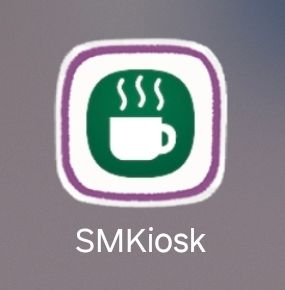

# kiosk_android

## 🎬 Demo Video

키오스크 주문을 위한 **Android 앱(사용자 주문 화면)** 입니다.  
카테고리/메뉴 조회 후 주문을 생성하며, 백엔드 API 서버와 연동됩니다.

- 📅 프로젝트 진행기간: 2025.11.17 ~ 2026.01.17
- 🖥 [Backend(Spring)](https://github.com/unnokid/kiosk_manage)
- 📌 [Notion 정리](https://www.notion.so/2626ec51d18480779573e8a6abe6b456)
- 📄 [사용 화면 예시](https://www.notion.so/2d86ec51d18480f7b62dcb46dac048c4)

---

## 1) Tech Stack
- Android Studio
- Java
- Retrofit2 
- RecyclerView
- Bluetooth Classic(SPP)
- ESC/POS Printing

---

## 2) Features
- 카테고리 목록 조회
- 카테고리별 메뉴 조회
- 찬조 등록
- 메뉴 선택 및 수량 처리
- 주문 생성 요청
- 주문, 찬조 내역 조회 및 일일 총 메뉴 판매량 확인
- (관리자) 카테고리 등록/삭제
- (관리자) 메뉴 등록/삭제

---

## 3) App Flow
1. 카테고리 조회
2. 메뉴 리스트 출력
3. 메뉴 선택 및 장바구니 구성
4. 주문 생성 API 호출
5. 주문 완료 처리

---

## 4) Run (Local)

### 4-1. 백엔드 서버 실행 필요
백엔드가 먼저 실행되어 있어야 합니다.

- Backend URL 예시: `http://localhost:8080`
- 에뮬레이터 사용 시: `http://10.0.2.2:8080`

### 4-2. local.properties 파일에서 설정
- API_BASE_URL : 서버 url 
- API_KEY : api 호출시 Header 검증값 
- PRINTER_MAC : 프린터 bluetooth Mac 주소(생략가능)

